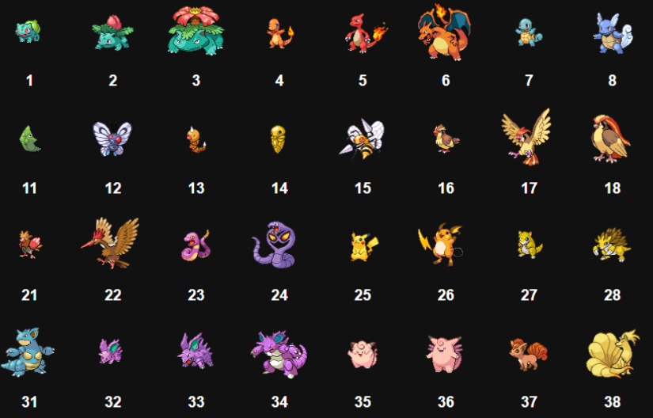
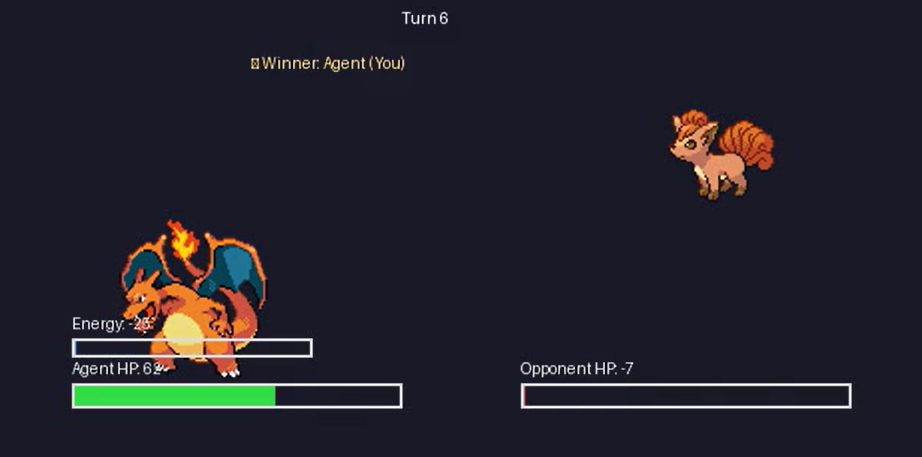
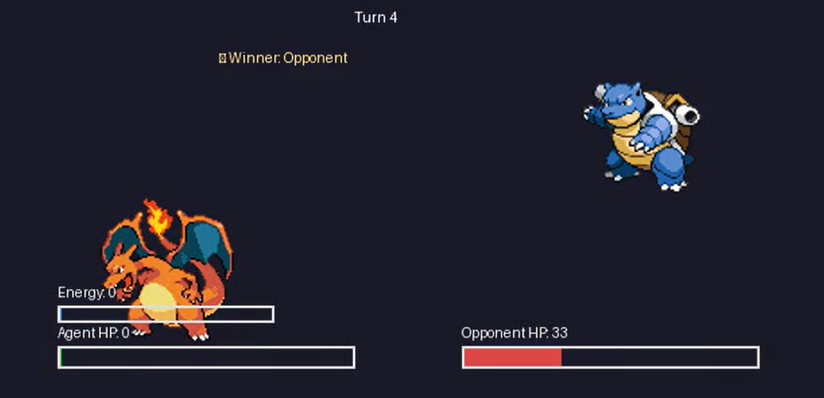

# 🎮 Pokémon Battle Arena: Reinforcement Learning Project

> **An AI Agent that learns to master Pokémon-style battles using Reinforcement Learning (PPO)**  



---

## 🌟 Overview

This project implements a **Reinforcement Learning (RL)** framework where an AI agent learns to win **Pokémon battles** using **Proximal Policy Optimization (PPO)**.  
Built completely from scratch, it combines **custom environment design**, **type-based combat mechanics**, and **cinematic video visualization** of battles.

---

## 🧠 Problem Statement

> Can an AI agent, without any pre-programmed rules, learn to play and win Pokémon battles purely through Reinforcement Learning?

This project builds a **custom Gymnasium environment** that allows an RL agent to learn **attack, defend, and heal strategies** based only on rewards and state transitions.

---

## ⚙️ System Architecture

```mermaid
graph TD
  subgraph Training_Loop
    A[Agent - PPO Model]
    E[Environment - PokemonBattleEnv]
    O[Observation/State]
    R[Reward]
    A -->|Select Action| E
    E -->|New State| O
    E -->|Reward| R
    O -->|Feed Observation| A
    R -->|Update Policy| A
  end

  subgraph Battle_Simulation
    P1[Player Pokemon (Agent)]
    P2[Opponent Pokemon (Environment)]
  end

  P1 --> A
  P2 --> E
  E -->|Battle Outcome| P1
  A -->|Improved Strategy| P1
```

---

## 🔍 Key Features

✅ **Custom RL Environment** — Built entirely using `gymnasium`  
✅ **PPO Agent (Stable-Baselines3)** — Learns through self-play and reward optimization  
✅ **Type-Based Combat System** — Fire 🔥 > Grass 🌿 > Water 💧 > Fire 🔥  
✅ **Dynamic Opponent Pool** — Battles with random Pokémon for diverse learning  
✅ **Visual Output** — Generates `.mp4` battle replays for analysis  
✅ **Reward Engineering** — Balanced incentives for attack, defense, and healing  

---

## 🧩 Methodology

1. **Custom Environment Creation**  
   - Defines HP, Energy, Actions, and Type Advantages  
   - Implements Gym-compatible reset and step functions  

2. **Agent Training (PPO)**  
   - Observes state `[HP, Energy, Opponent HP, Turn]`  
   - Takes actions: *Light Attack, Heavy Attack, Guard, Recover*  
   - Learns via reward feedback (damage dealt, win/loss)  

3. **Evaluation & Tournament Phase**  
   - Trained model battles multiple opponents (randomly selected)  
   - Results recorded and visualized as MP4 battle videos  

---

## 🎬 Demo Battles

### Example Battle 1


### Example Battle 2


---

## 📊 Results

| Opponent | Type | Result |
|-----------|-------|--------|
| Charmander | Fire | ✅ Win |
| Squirtle | Water | ❌ Loss |
| Bulbasaur | Grass | ✅ Win |
| Pikachu | Electric | ✅ Win |
| Gengar | Normal | ✅ Win |

---

## 🧠 Technologies Used

| Category | Tools |
|-----------|--------|
| Programming | Python 3.12 |
| Frameworks | Gymnasium, Stable-Baselines3 |
| Model | PPO (Proximal Policy Optimization) |
| Visualization | MoviePy, OpenCV, PIL |
| Environment | Google Colab / VS Code |
| Hardware | GPU / TPU Accelerator |

---

## 🚀 How to Run

### 1️⃣ Clone Repository
```bash
git clone https://github.com/<your-username>/Pokemon-Battle-RL-Arena.git
cd Pokemon-Battle-RL-Arena
```

### 2️⃣ Install Dependencies
```bash
pip install -r requirements.txt
```

### 3️⃣ Run the Notebook
Open `Pokemon_Battle_RL_Arena.ipynb` in Google Colab or VS Code Jupyter.

### 4️⃣ Train and Watch Battles
After training, run the **tournament cell** — it will:
- Generate videos under `/battle_videos/`
- Display inline replay battles

---

## 📚 References

- Schulman et al., *Proximal Policy Optimization Algorithms*, OpenAI (2017)  
- Stable Baselines3 Documentation  
- Pokémon API Sprites Repository  
- OpenAI Gymnasium Framework  

---

## 👥 Team & Credits

**Authors:**  
- Jayal Shah  
- Mayank Jangid  
- Dhairya Jadav  

**Mentor:** Palwinder Singh  

---

## 🏁 Future Scope
- Add advanced moves (e.g., status effects, elemental buffs)  
- Expand to 3D animation (Unity/Blender integration)  
- Include live Streamlit dashboard for real-time battle visualizations  

---

⭐ **If you liked this project, give it a star on GitHub!**
